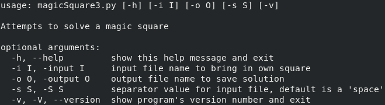
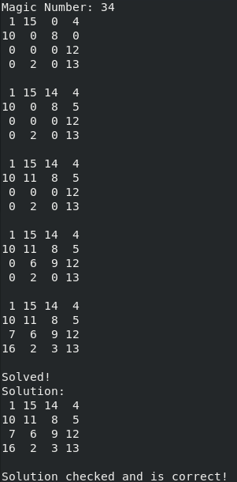

# MagicSquare
Python scripts to help solve Magic Squares

## Background
Basic info (Links last tested on 10/21/2020)

https://en.wikipedia.org/wiki/Magic_square

http://www.mathematische-basteleien.de/magsquare.htm

## Script Files
**magicSquare2.py** - Python 2 version (tested on Python 2.7.17)

**magicSquare3.py** - Python 3 version (tested on Python 3.6.8)

## Miscellaneous Files
**magicSquare4x4Test.png** - image used in readme
 **magicSquareHelp.png** - image used in readme
 **output.txt** - output of 3x3 square using " " as separators
 **output2.txt** - output of 4x4 square using " " as separators
 **square4x4.txt** - input of an unsolved 4x4 square using " " as separators
 **square5x5.txt** - input of an unsolved 5x5 square using " " as separators
 **squareComma4x4.txt** - input of an unsolved 4x4 square using "," as separators
 **squareCommaInput.txt** - input of an unsolved 3x3 square using "," as separators
 **squareInput.txt** - input of an unsolved 3x3 square using " " as separators
 **testOutputComma.txt** - output of 4x4 square using "," as separators
 **testSquare.txt** - output of 3x3 square using "," as separators

## How to Use
*NOTE: Assumes python3 refers to Python 3 on command line and python2 refers to Python 2 on command line.*
* (all commands shown in Python 3, simply use python2 magicSquare2.py instead of python3 magicSquare3.py)*

 Running the following bash command displays the accepted argument flags (flags are the same for Python 2 and Python 3):
 `$ python3 magicSquare3.py -h`

 For instance if you want to run **magicSquare3.py** on **square4x4.txt**, you would run the following command:
 `$ python3 magicSquare3.py -i square4x4.txt`

This will solve the 4x4 in **square4x4.txt** and display the results on the screen:

 However, if you want to use a different separator than spaces(" ") like commas(",") perhaps. You could run the following command:
 `$ python3 magicSquare3.py -i squareComma4x4.txt -s ","`

This will solve the 4x4 in **squareComma4x4.txt** that has commas(",") as a separator in the file. It will display the results on the screen.

 If you also want to save the results into a file, you can save the final solve state by using the following command:
 `$ python3 magicSquare3.py -i squareComma4x4.txt -o testOutput.txt -s ","`

Which will solve the square **squareComma4x4.txt**, then create a file named ***testOutput.txt*** and write the final solution to ***testOutput.txt***
 ***testOutput.txt*** looks like:
>1,15,14,4
> 10,11,8,5
> 7,6,9,12
> 16,2,3,13

*NOTE: If you get* `"Cannot solve, too little information."`*: It means that there are not enough numbers to allow the computer to accurately determine the correct numbers. This script does not currently have guessing capabilities.*

## Future Work
- [ ] Create a flag to allow user to control if program should wait during display.
- [ ] Create a flag to allow user to write steps and final state to a file.
- [ ] Create a flag to allow user to specify the output file's separator, so it can be unique from the input file's separator.
- [ ] Allow for guessing.
